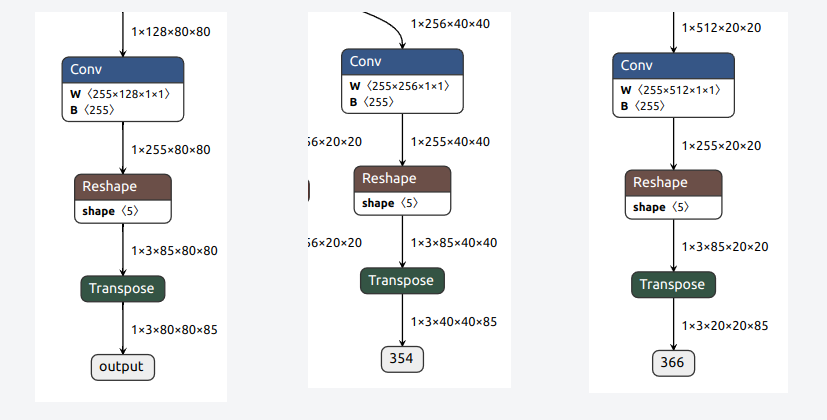

# Install Ncnn
```
git clone https://github.com/Tencent/ncnn.git
cd ncnn
git submodule update --init
sudo apt install build-essential git cmake libprotobuf-dev protobuf-compiler libvulkan-dev vulkan-utils libopencv-dev
wget https://sdk.lunarg.com/sdk/download/1.2.189.0/linux/vulkansdk-linux-x86_64-1.2.189.0.tar.gz?Human=true -O vulkansdk-linux-x86_64-1.2.189.0.tar.gz
tar -xf vulkansdk-linux-x86_64-1.2.189.0.tar.gz
export VULKAN_SDK=$(pwd)/1.2.189.0/x86_64
cd ncnn
mkdir -p build
cd build
cmake -DCMAKE_BUILD_TYPE=Release -DCMAKE_OSX_ARCHITECTURES="x86_64" -DNCNN_VULKAN=ON -DNCNN_BUILD_EXAMPLES=ON -DNCNN_BUILD_TOOLS=ON -DNCNN_DISABLE_RTTI=OFF ..
make -j$(nproc)
make install
```
# Convert yolov5 -> onnx -> ncnn
1. Environment
+ HostPC: Ubuntu20.04
+ YOLOv5: https://github.com/ultralytics/yolov5/tree/v6.2
    + version v6.2

```
git clone https://github.com/shaoshengsong/yolov5_62_export_ncnn
cd yolov5_62_export_ncnn
../examples/yolov5 bus.jpg
sudo apt install -y python3-pip
python3 -m pip install -U pip
python3 -m pip install -r requirements.txt
$ get https://github.com/ultralytics/yolov5/releases/download/v6.2/yolov5s.pt
$ python3 export.py --weights yolov5s.pt --img 640 --batch 1 --include onnx --simplify
$ ls yolov5s.onnx
yolov5s.onnx
```
The conversion from ONNX models to ncnn models is done using onnx2ncnn, which is created in build/install/bin/onnx2ncnn when ncnn is built & installed.
```
../install/bin/onnx2ncnn yolov5s.onnx yolov5s.param yolov5s.bin
```
Now, if we look at ncnn’s YOLOv5 sample code, we can see that the model is loaded by directly specifying yolov5s_6.2.param and yolov5s_6.2.bin. The files created this time are yolov5s.param and yolov5s.bin, so the file names should be changed as follows

```
diff --git a/examples/yolov5.cpp b/examples/yolov5.cpp
index 88f6db2..ef5b2d5 100644
--- a/examples/yolov5.cpp
+++ b/examples/yolov5.cpp
@@ -280,9 +280,9 @@ static int detect_yolov5(const cv::Mat& bgr, std::vector<Object>& objects)
     // original pretrained model from https://github.com/ultralytics/yolov5
     // the ncnn model https://github.com/nihui/ncnn-assets/tree/master/models
 #if YOLOV5_V62
-    if (yolov5.load_param("yolov5s_6.2.param"))
+    if (yolov5.load_param("yolov5s.param"))
         exit(-1);
-    if (yolov5.load_model("yolov5s_6.2.bin"))
+    if (yolov5.load_model("yolov5s.bin"))
         exit(-1);
 #elif YOLOV5_V60
     if (yolov5.load_param("yolov5s_6.0.param"))
```
Build and run again.
```
$ make -C ..
$ ../examples/yolov5 bus.jpg
find_blob_index_by_name 353 failed
Try
    ex.extract("output", out0);
    ex.extract("354", out1);
    ex.extract("366", out2);
Floating point exception (core dumped)
```
Unlike before, an error was displayed and bus.jpg did not show up.

Here is a brief explanation of how to fix it.

First, let’s examine yolov5s.param for the above error.

```
$ grep -w -e output -e 354 -e 366 yolov5s.param 
Permute          /model.24/Transpose      1 1 /model.24/Reshape_output_0 output 0=1
Permute          /model.24/Transpose_1    1 1 /model.24/Reshape_1_output_0 354 0=1
Permute          /model.24/Transpose_2    1 1 /model.24/Reshape_2_output_0 366 0=1
```
It contained the numbers output, 354 and 366. let’s visualize yolov5s.onnx at https://netron.app.



The yolov5s.onnx seems to have three outputs: output, 354, and 366.

On the other hand, examine yolov5s_6.2.param in shaoshengsong/yolov5_62_export_ncnn.

```
$ grep Permute yolov5s_6.2.param
Permute          Transpose_200            1 1 338 output 0=1
Permute          Transpose_203            1 1 352 353 0=1
Permute          Transpose_206            1 1 366 367 0=1
```

The display is slightly different, but output, 353 and 367 seem to be the outputs. This differs from the values (354, 366) examined yolov5s.param.

If we look at the sample code for YOLOv5 in ncnn, the following code exists.

```
$ grep -w -e 353 -e 367 ../../examples/yolov5.cpp 
        ex.extract("353", out);
        ex.extract("367", out);
```
It seems that output is specified here. yolov5.cpp should be modified as follows.
```
@@ -366,7 +366,7 @@ static int detect_yolov5(const cv::Mat& bgr, std::vector<Object>& objects)
         ncnn::Mat out;
 
 #if YOLOV5_V62
-        ex.extract("353", out);
+        ex.extract("354", out);
 #elif YOLOV5_V60
         ex.extract("376", out);
 #else
@@ -391,7 +391,7 @@ static int detect_yolov5(const cv::Mat& bgr, std::vector<Object>& objects)
     {
         ncnn::Mat out;
 #if YOLOV5_V62
-        ex.extract("367", out);
+        ex.extract("366", out);
 #elif YOLOV5_V60
         ex.extract("401", out);
 #else
```
Build and run again.

```
$ make -C ..
$ ../examples/yolov5 bus.jpg
67 = 0.99632 at 656.76 509.26 152.24 x 0.00
67 = 0.99476 at 644.50 499.47 164.50 x 0.00
67 = 0.99158 at 809.00 464.90 0.00 x 0.00
67 = 0.98984 at 809.00 452.97 0.00 x 0.00
67 = 0.98339 at 195.63 596.97 222.76 x 0.00
67 = 0.98278 at 749.81 304.04 59.19 x 0.00
67 = 0.98148 at 809.00 294.05 0.00 x 0.00
67 = 0.97992 at 0.00 523.36 195.36 x 0.00
67 = 0.97671 at 726.73 307.79 82.27 x 0.00
67 = 0.97668 at 45.13 341.54 48.62 x 0.00
```
The details can be found in (this)[https://zhuanlan.zhihu.com/p/275989233] article, but we will modify the parameters of Reshape. The format of the parameters can be found here.

--> follow: https://i7y.org/en/how-to-convert-yolov5-model-to-ncnn-model/

# Communication PC -> Arduino
